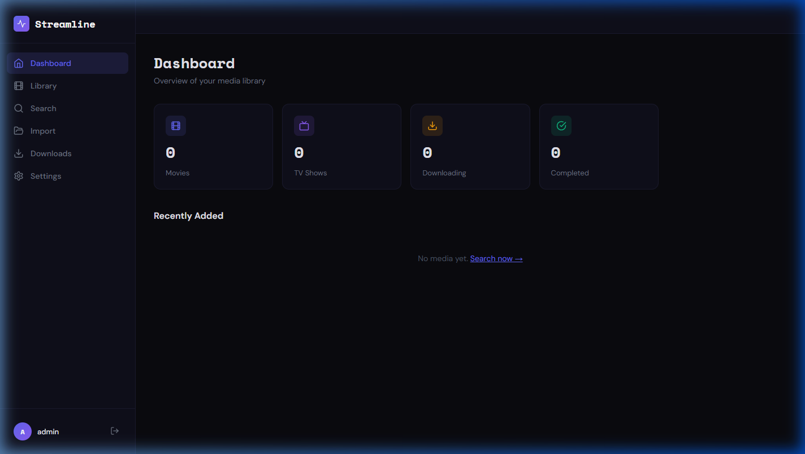
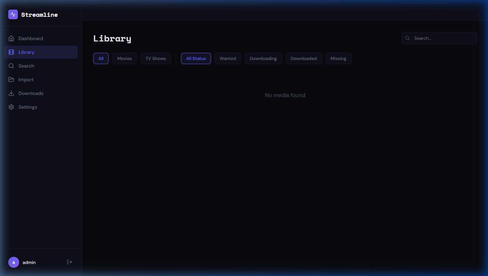
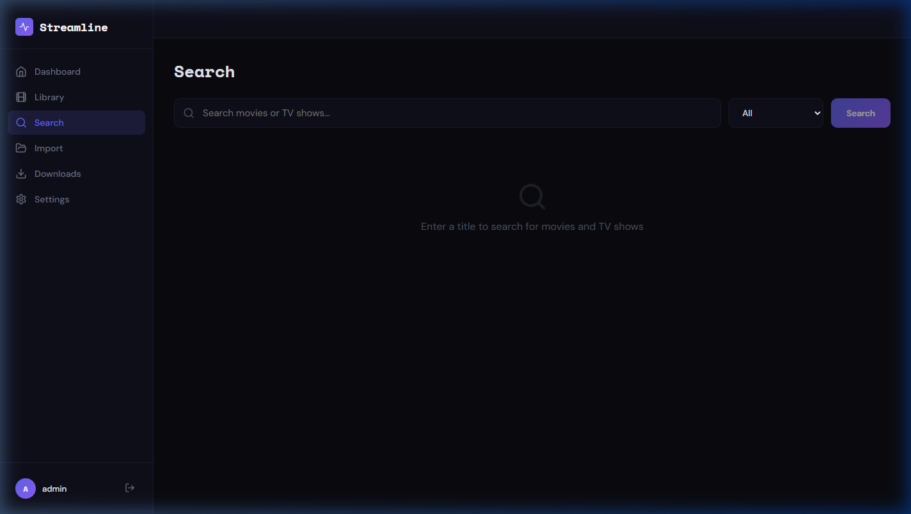
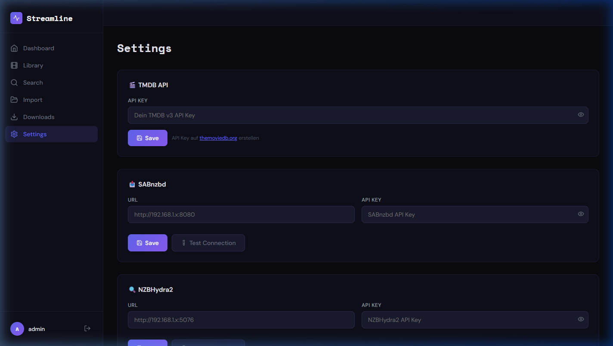

# 🎬 Streamline

**Streamline** ist ein selbstgehosteter Media-Manager als Alternative zu Sonarr + Radarr — beide Funktionen in einer einzigen, modernen Oberfläche vereint.


## Screenshots

| Dashboard | Mediathek |
|---|---|
|  |  |

| Suche | Einstellungen |
|---|---|
|  |  |

---

## Features

- **Filme & Serien** in einer Oberfläche verwalten (Sonarr + Radarr Ersatz)
- **TMDB-Integration** — Metadaten, Poster, Bewertungen automatisch abrufen
- **SABnzbd** — Live-Queue, Pause/Resume/Delete, NZB direkt senden
- **NZBHydra2** — Newznab-Indexer-Suche integriert
- **Torrent-Indexer** — Torznab/Newznab Indexer per API Key & URL einbinden
- **Qualitätsprofile** — 720p / 1080p / 2160p / Any
- **Serien-Episodenverwaltung** — Staffeln und Episoden mit Status-Tracking
- **Ersteinrichtung-Wizard** — Admin-Account beim ersten Start
- **JWT-Authentifizierung** mit sicherer Token-Verwaltung
- **Vollständig Dockerisiert** — startet mit einem Befehl

---

## Sicherheit

Streamline wurde mit Security-First-Ansatz entwickelt:

| Maßnahme | Details |
|---|---|
| **Passwort-Hashing** | bcrypt mit 12 Salt-Rounds |
| **JWT-Tokens** | HS256, 24h Ablauf, Issuer-Validierung |
| **Rate Limiting** | 200 req/15min allgemein, 10 req/15min für Login |
| **Helmet.js** | Sicherheits-HTTP-Header (CSP, HSTS, etc.) |
| **Input-Validierung** | express-validator auf allen Endpunkten |
| **SQL-Injection-Schutz** | Prepared Statements (better-sqlite3) |
| **CORS-Whitelist** | Nur explizit erlaubte Origins |
| **Non-root Container** | Backend und Frontend laufen ohne Root |
| **API Keys verschlüsselt** | Werden nie im Klartext zurückgegeben |
| **Audit-Log** | Alle kritischen Aktionen werden protokolliert |
| **Timing-Attack-Schutz** | Immer bcrypt.compare(), auch bei ungültigem User |

---

## Schnellstart

### Voraussetzungen

- Docker >= 24.0
- Docker Compose >= 2.0

### 1. Repository klonen

```bash
git clone https://github.com/dein-user/streamline.git
cd streamline
```

### 2. Umgebungsvariablen setzen

```bash
cp .env.example .env
```

Öffne `.env` und setze mindestens den `JWT_SECRET`:

```bash
# JWT_SECRET generieren:
openssl rand -hex 32
```

```env
JWT_SECRET=dein_generierter_geheimer_schlüssel_hier
HOST_PORT=7878
```

### 3. Starten

```bash
docker compose up -d --build
```

Streamline ist dann erreichbar unter: **http://localhost:7878**

### 4. Ersteinrichtung

Beim ersten Aufruf wirst du automatisch zum Setup-Wizard weitergeleitet, wo du deinen Administrator-Account erstellst.

---

## Konfiguration

### Umgebungsvariablen (`.env`)

| Variable | Standard | Beschreibung |
|---|---|---|
| `JWT_SECRET` | — | **Pflicht.** Mindestens 32 Zeichen. Mit `openssl rand -hex 32` generieren |
| `HOST_PORT` | `7878` | Port auf dem Host |
| `ALLOWED_ORIGINS` | `http://localhost:7878` | Erlaubte CORS-Origins (kommagetrennt) |
| `LOG_LEVEL` | `info` | Logging-Level: error / warn / info / debug |

### Integrationen einrichten

Nach dem Login unter **Einstellungen**:

#### TMDB API Key
1. Konto auf [themoviedb.org](https://www.themoviedb.org) erstellen
2. Unter *Einstellungen → API* einen v3 API Key beantragen
3. Key in Streamline unter *Einstellungen → TMDB API* eintragen

#### SABnzbd
- URL: `http://192.168.1.x:8080` (oder deine SABnzbd-Adresse)
- API Key: In SABnzbd unter *Konfiguration → Allgemein → API-Schlüssel*

#### NZBHydra2
- URL: `http://192.168.1.x:5076`
- API Key: In NZBHydra2 unter *Config → Authorization*

#### Torrent-Indexer (Torznab/Newznab)
- Beliebig viele Indexer mit Name, Typ, URL und API Key hinzufügbar
- Kompatibel mit Jackett, Prowlarr, NZBHydra2-Torznab-Proxies

---

## Docker Compose (Produktiv)

```yaml
# Angepasstes Beispiel für Heimnetz mit Traefik/Reverse Proxy
services:
  streamline-backend:
    image: streamline-backend
    environment:
      - JWT_SECRET=${JWT_SECRET}
      - ALLOWED_ORIGINS=https://media.deinedomain.de

  streamline-frontend:
    image: streamline-frontend
    ports:
      - "7878:80"
```

---
---

## 🤖 Telegram Bot & Discord Webhook

Streamline kommt mit einem nativen Bot-Container — kein externes Tool nötig.

### Telegram Bot einrichten

**1. Bot bei @BotFather erstellen:**
```
/newbot
→ Name: Streamline
→ Username: mein_streamline_bot
→ Token: 123456:ABC-DEF... ← in .env eintragen
```

**2. Chat-ID herausfinden:**
Schreibe deinem Bot eine Nachricht, dann:
```bash
curl https://api.telegram.org/bot<TOKEN>/getUpdates
# "chat":{"id": 123456789}  ← das ist deine TELEGRAM_CHAT_ID
```

**3. Bot-User in Streamline anlegen** *(nach dem ersten Start)*:
Logge dich ein → Einstellungen → Benutzer → neuen User `bot` anlegen, Passwort in `.env` als `STREAMLINE_BOT_PASS` eintragen.

**4. In `.env` eintragen und neu starten:**
```env
TELEGRAM_TOKEN=123456:ABC-DEF...
TELEGRAM_CHAT_ID=123456789
STREAMLINE_BOT_USER=bot
STREAMLINE_BOT_PASS=dein_bot_passwort
BOT_SECRET=<openssl rand -hex 16>
```

### Bot-Befehle

| Befehl | Funktion |
|---|---|
| `/start` | Hilfe & Befehlsübersicht |
| `/status` | Systemübersicht (Filme, Serien, Downloads) |
| `/library` | Gesamte Mediathek |
| `/movies` | Nur Filme |
| `/series` | Nur Serien |
| `/wanted` | Gewünschte Medien |
| `/search <Titel>` | TMDB durchsuchen + inline hinzufügen |
| `/add_movie <TMDB-ID>` | Film direkt per ID hinzufügen |
| `/add_series <TMDB-ID>` | Serie direkt per ID hinzufügen |
| `/queue` | SABnzbd Live-Queue |
| `/history` | Download-Verlauf |

### Discord Webhook einrichten

**1. Webhook in Discord erstellen:**
```
Server-Einstellungen → Integrationen → Webhooks → Neuer Webhook
→ Kanal wählen → Webhook-URL kopieren
```

**2. In `.env` eintragen:**
```env
DISCORD_WEBHOOK_URL=https://discord.com/api/webhooks/...
```

**Automatische Discord-Benachrichtigungen bei:**
- ✅ Neues Medium zur Mediathek hinzugefügt
- ✅ Download abgeschlossen
- ❌ Download fehlgeschlagen
- ☀️ Tägliche Zusammenfassung (08:00 Uhr)

---

## Architektur

```
┌─────────────────────────────────────────────┐
│              Browser / Client               │
└──────────────────────┬──────────────────────┘
                       │ HTTP :7878
┌──────────────────────▼──────────────────────┐
│         Nginx (Frontend Container)          │
│   React SPA + Reverse Proxy für /api/*      │
└──────────┬──────────────────────────────────┘
           │ /api/* → http://backend:3001
┌──────────▼──────────────────────────────────┐
│      Node.js / Express (Backend Container)  │
│                                             │
│  Auth │ Media │ Search │ Settings │ DLs     │
└──────────┬──────────────────────────────────┘
           │
┌──────────▼──────────┐   ┌─────────────────┐
│  SQLite (Persistent │   │ External APIs:  │
│  Docker Volume)     │   │ TMDB, SABnzbd,  │
└─────────────────────┘   │ NZBHydra2, ...  │
                          └─────────────────┘
```

---

## Volumes & Datenspeicherung

| Volume | Inhalt |
|---|---|
| `streamline_data` | SQLite-Datenbank mit allen Mediendaten |
| `streamline_logs` | Backend-Logs (rotiert, max. 50 MB) |

### Backup

```bash
# Datenbank sichern
docker compose exec backend cp /app/data/streamline.db /app/data/streamline.db.backup
docker cp streamline-backend:/app/data/streamline.db ./backup_$(date +%Y%m%d).db
```

---

## Updates

```bash
git pull
docker compose down
docker compose up -d --build
```

---

## Logs

```bash
# Alle Container
docker compose logs -f

# Nur Backend
docker compose logs -f backend

# Nur Frontend/Nginx
docker compose logs -f frontend
```

---

## Entwicklung (ohne Docker)

```bash
# Backend
cd backend
npm install
cp .env.example .env  # JWT_SECRET setzen
node server.js

# Frontend (anderes Terminal)
cd frontend
npm install
npm start
```

Frontend läuft auf `http://localhost:3000`, Backend auf `http://localhost:3001`.

---

## Fehlerbehebung

**Container startet nicht:**
```bash
docker compose logs backend
# Häufige Ursache: JWT_SECRET nicht gesetzt oder zu kurz (min. 32 Zeichen)
```

**TMDB-Suche funktioniert nicht:**
- API Key in den Einstellungen überprüfen
- TMDB erlaubt nur v3 API Keys (nicht Bearer Tokens)

**SABnzbd nicht erreichbar:**
- URL muss aus dem Docker-Netzwerk erreichbar sein
- `localhost` des Hosts ist im Container **nicht** `localhost` — verwende die Host-IP oder Hostname

**Port-Konflikt:**
```bash
# Port in .env ändern
HOST_PORT=8989
docker compose up -d
```

---

## Lizenz

MIT License — siehe [LICENSE](LICENSE)

---

## Danke

Inspiriert von [Sonarr](https://sonarr.tv) und [Radarr](https://radarr.video). Nutzt die [TMDB API](https://www.themoviedb.org/documentation/api).

> ⚠️ **Hinweis:** Streamline ist ein Verwaltungstool. Das Herunterladen urheberrechtlich geschützter Inhalte ohne Erlaubnis ist illegal und liegt in der Verantwortung des Nutzers.
